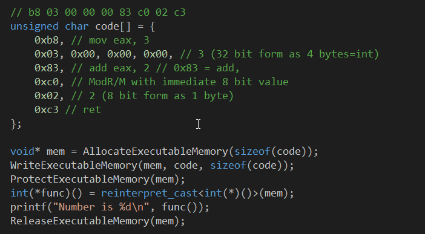

# JitTest

Description: This project is divided into two projects. JitTest is using x86 machine instructions. It allocates and writes this executable machine code into memory, then tells the OS to run the program. Normal executable files are compiled and therefore has the machine code frozen inside the executable file. This is alright in most cases but what if you wanted to make a programming language able to dynamically change to machine code on the fly at run-time? This where Just-In-Time (JIT) comes in. I wanted to know how to make the JIT able to call C++ functions, so I asked on stackoverflow: https://stackoverflow.com/questions/41991398/call-functions-from-x86-64-assembly

Tags: C++, JIT, x86, x64, CPU
